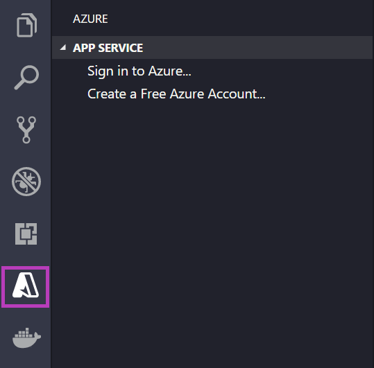
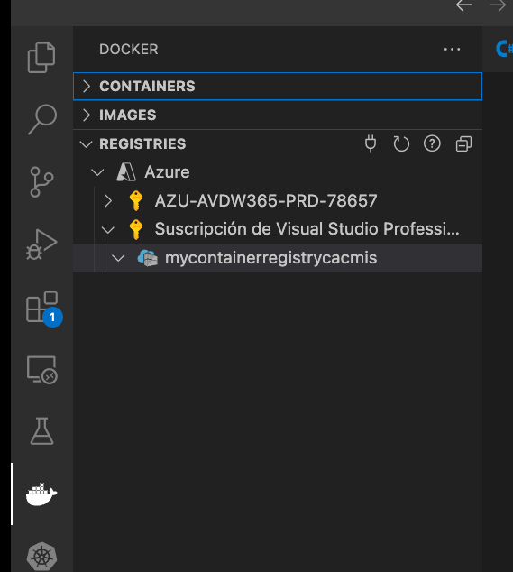

# Run a custom container in Azure

## Create a container registry

1. Create a resource group

        az group create --name myResourceGroupCacmis --location eastus

2. Create a container registry

        az acr create --resource-group myResourceGroupCacmis --name mycontainerregistrycacmis --sku Basic

3. Login in Visual Studio Code 

4. Select the Docker logo. In the REGISTRIES explorer, verify that the container registry you created appears
